# AlgoArena Architecture

> Technical deep-dive into the AI Trading Auto-Battler built on Movement Network

---

## System Overview

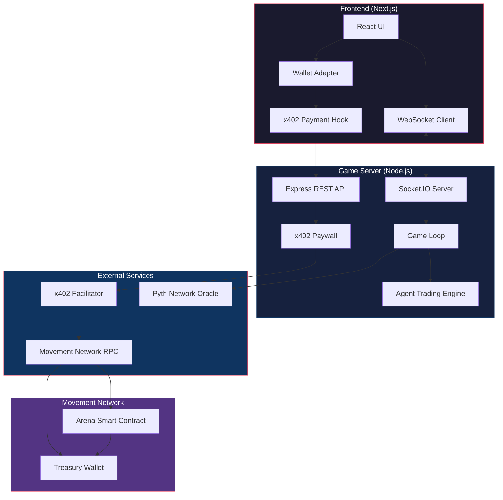

---

## x402 Payment Flow

The x402 protocol enables HTTP-native micropayments using the `402 Payment Required` status code.

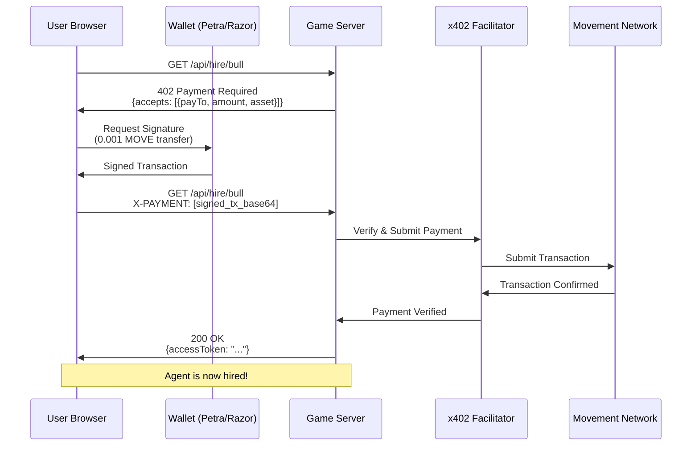

### x402 Payment Header Format

```typescript
// Payment header structure (base64 encoded)
{
  signatureBcsBase64: string,  // Ed25519 signature
  transactionBcsBase64: string // Unsigned transfer transaction
}
```

### Server-Side x402 Configuration

```typescript
x402Paywall(TREASURY_ADDRESS, {
  "GET /api/hire/bull": {
    network: "movement",
    asset: "0x1::aptos_coin::AptosCoin",
    maxAmountRequired: "100000",  // 0.001 MOVE
    description: "Hire Bullish Bob",
  },
  // ... more endpoints
});
```

---

## Smart Contract Architecture

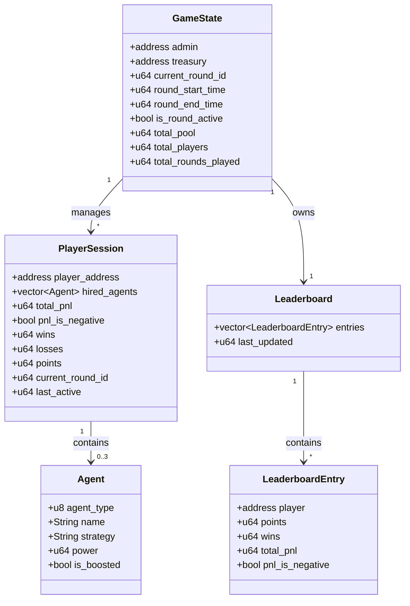

### Contract Entry Functions

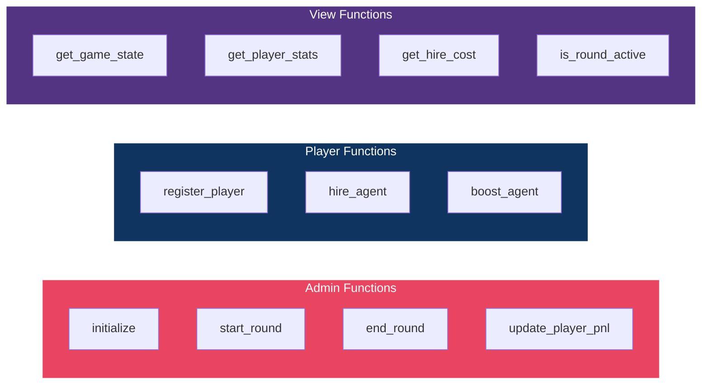

---

## Price Feed Integration (Pyth Network)

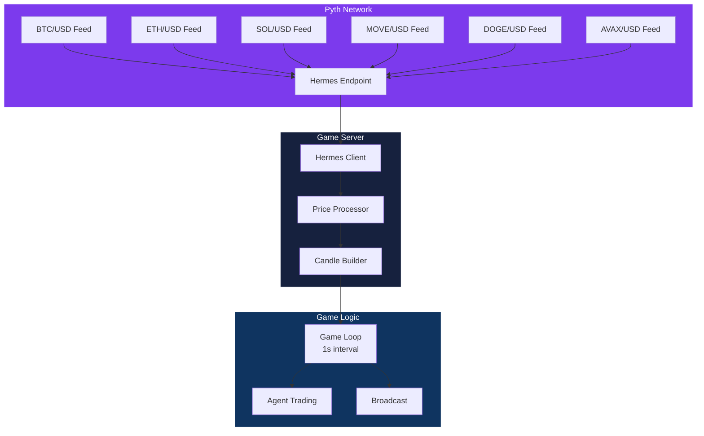

### Price Feed IDs (Pyth Stable)

| Asset | Price Feed ID |
|-------|--------------|
| BTC/USD | `0xe62df6c8b4a85fe1a67db44dc12de5db330f7ac66b72dc658afedf0f4a415b43` |
| ETH/USD | `0xff61491a931112ddf1bd8147cd1b641375f79f5825126d665480874634fd0ace` |
| SOL/USD | `0xef0d8b6fda2ceba41da15d4095d1da392a0d2f8ed0c6c7bc0f4cfac8c280b56d` |
| MOVE/USD | `0x6bf748c908767baa762a1563d454ebec2d5108f8ee36d806aadacc8f0a075b6d` |
| DOGE/USD | `0xdcef50dd0a4cd2dcc17e45df1676dcb336a11a61c69df7a0299b0150c672d25c` |
| AVAX/USD | `0x93da3352f9f1d105fdfe4971cfa80e9dd777bfc5d0f683ebb6e1294b92137bb7` |

---

## AI Agent Trading Logic

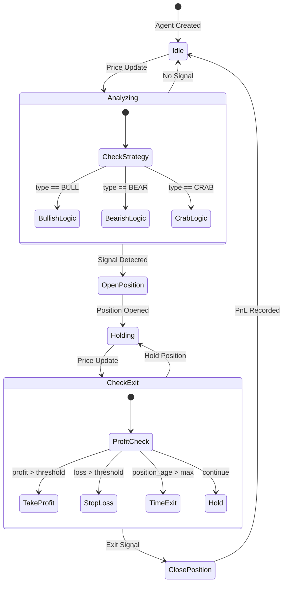

### Agent Strategies

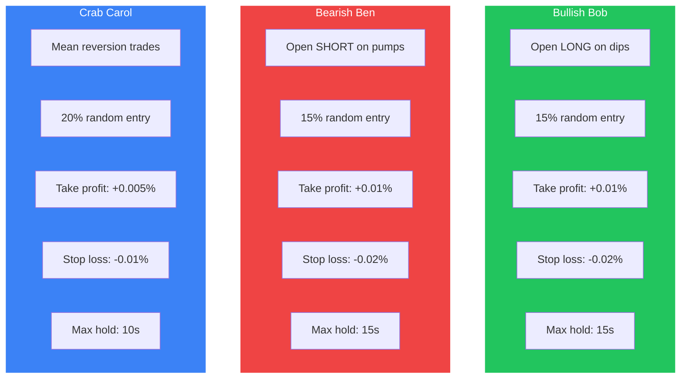

---

## Game Round Lifecycle

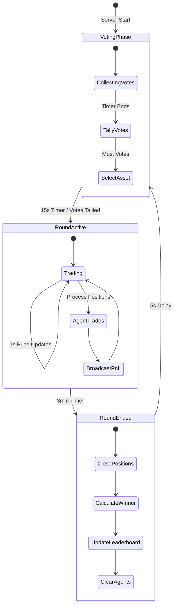

---

## Real-Time Communication (Socket.IO)

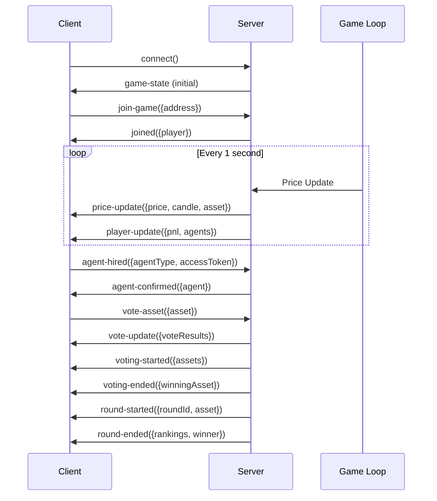

### Socket Events Reference

| Event | Direction | Payload |
|-------|-----------|---------|
| `game-state` | Server -> Client | Full game state on connect |
| `price-update` | Server -> Client | `{price, candle, asset, assetIcon}` |
| `player-update` | Server -> Client | `{address, pnl, agents[]}` |
| `join-game` | Client -> Server | `{address}` |
| `agent-hired` | Client -> Server | `{address, agentType, accessToken}` |
| `vote-asset` | Client -> Server | `{address, asset}` |
| `round-started` | Server -> Client | `{roundId, startTime, endTime, asset}` |
| `round-ended` | Server -> Client | `{roundId, rankings, winner}` |

---

## Data Flow Diagram

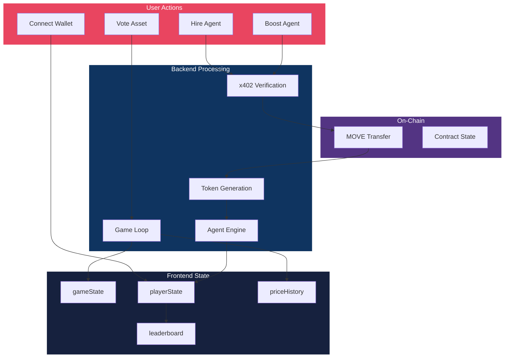

---

## Technology Stack

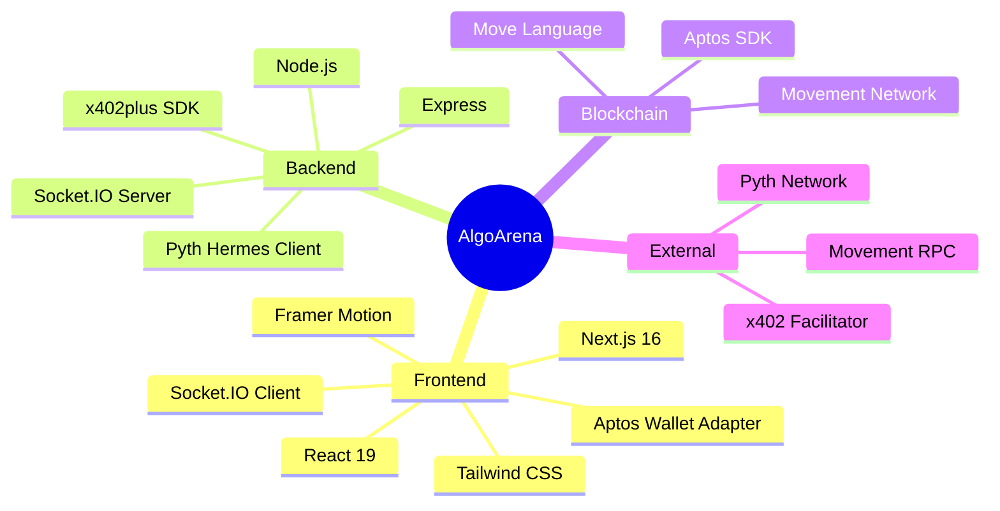

---

## Deployment Architecture

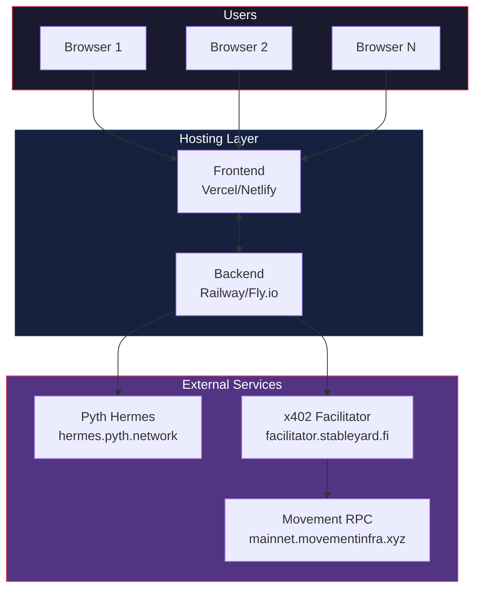

---

## Security Considerations

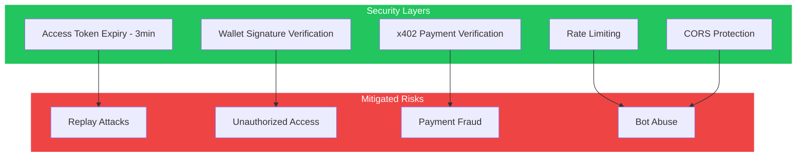

---

## Future Enhancements

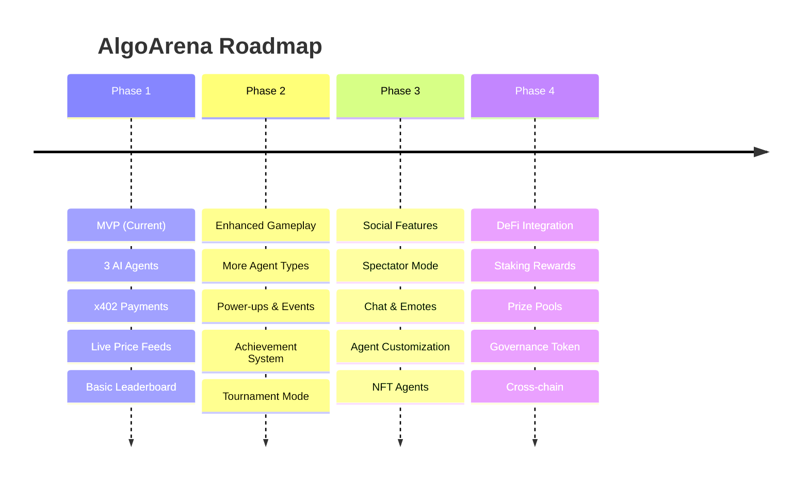

---

## Quick Reference

### Environment Variables

```bash
# Server
PORT=4402
MOVEMENT_RPC=https://full.mainnet.movementinfra.xyz/v1
MOVEMENT_PAY_TO=0x...treasury_address
FACILITATOR_URL=https://facilitator.stableyard.fi
FRONTEND_URL=http://localhost:3000

# Frontend
NEXT_PUBLIC_SERVER_URL=http://localhost:4402
```

### Key Files

| File | Purpose |
|------|---------|
| `contracts/sources/arena.move` | Move smart contract |
| `server/src/index.ts` | Game server |
| `src/hooks/use-x402-payment.ts` | x402 client integration |
| `src/hooks/use-game-socket.ts` | WebSocket state management |
| `src/components/arena.tsx` | Trading chart visualization |

---

*Built for Movement Encode M1 Hackathon*
