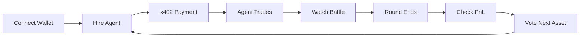

<h1 align="center">AlgoArena</h1>

<p align="center">
  <strong>AI Trading Auto-Battler on Movement Network</strong>
</p>

<p align="center">
  <a href="#features">Features</a> |
  <a href="#how-it-works">How It Works</a> |
  <a href="#architecture">Architecture</a> |
  <a href="#getting-started">Getting Started</a> |
  <a href="#demo">Demo</a>
</p>

<p align="center">
  
  
  
  
</p>

---

## What is AlgoArena?

**AlgoArena** transforms complex trading into an accessible, competitive game. Instead of analyzing charts yourself, you hire AI trading agents to battle for you on live cryptocurrency price feeds.

> Trade Different. Win Together.

```
                     YOU DON'T TRADE.
                     YOUR AGENTS DO.

     BULLISH BOB          BEARISH BEN          CRAB CAROL
         LONG                SHORT              SCALPER
          ^                   v                  <-->
          |                   |                   | |
          +----> PROFIT <-----+                   +-+
```

---

## Features

### AI Trading Agents

| Agent | Strategy | Personality | Best Market |
|-------|----------|-------------|-------------|
| **Bullish Bob** | Buys dips, rides momentum | Aggressive optimist | Bull runs |
| **Bearish Ben** | Shorts pumps, covers lows | Cautious pessimist | Downtrends |
| **Crab Carol** | Mean reversion scalping | Patient opportunist | Sideways chop |

### x402 Micropayments

Revolutionary HTTP-native payments using the `402 Payment Required` status code:

```
1. Click "HIRE"           -> Request resource
2. Receive 402            -> Payment requirements
3. Sign transaction       -> One wallet signature
4. Submit payment         -> Instant verification
5. Agent activated!       -> No wallet popups
```

**Cost**: Just 0.001 MOVE per agent (~$0.001)

### Live Price Feeds

Real-time prices from **Pyth Network** oracle:

- BTC/USD
- ETH/USD
- SOL/USD
- MOVE/USD
- DOGE/USD
- AVAX/USD

Players vote on which asset to trade each round!

### Real-Time Competition

- **3-minute rounds** with live candlestick charts
- **15-second voting** between rounds
- **Instant PnL updates** via WebSocket
- **Global leaderboard** tracking wins and points

---

## How It Works



### Game Loop

1. **Voting Phase** (15s) - Players vote on next trading pair
2. **Round Active** (3min) - Agents trade automatically
3. **Round End** - Positions closed, PnL calculated, winner announced
4. **Repeat** - New voting phase begins

### Agent Trading Logic

**Bullish Bob:**
```
IF price_dips OR random(15%):
    OPEN LONG position

IF profit > 0.01% OR loss > 0.02% OR time > 15s:
    CLOSE position
```

**Bearish Ben:**
```
IF price_pumps OR random(15%):
    OPEN SHORT position

IF profit > 0.01% OR loss > 0.02% OR time > 15s:
    CLOSE position
```

**Crab Carol:**
```
IF price_moved OR random(20%):
    OPEN OPPOSITE position (mean reversion)

IF profit > 0.005% OR loss > 0.01% OR time > 10s:
    CLOSE position
```

---

## Architecture

For comprehensive technical documentation with Mermaid diagrams, see **[ARCHITECTURE.md](./ARCHITECTURE.md)**.

### System Overview

```
+------------------+     WebSocket     +------------------+
|                  | <---------------> |                  |
|   Next.js UI     |                   |   Game Server    |
|   (React 19)     | --- x402 HTTP --> |   (Express)      |
|                  |                   |                  |
+------------------+                   +------------------+
        |                                       |
        |                                       |
        v                                       v
+------------------+                   +------------------+
|                  |                   |                  |
|  Wallet Adapter  |                   |  Pyth Oracle     |
|  (Aptos/Privy)   |                   |  (Price Feeds)   |
|                  |                   |                  |
+------------------+                   +------------------+
        |
        v
+------------------+     x402          +------------------+
|                  | <---------------> |                  |
| Movement Network |                   | x402 Facilitator |
|   (Mainnet)      |                   |                  |
+------------------+                   +------------------+
```

### Tech Stack

| Layer | Technology |
|-------|------------|
| **Frontend** | Next.js 16, React 19, Tailwind CSS, Framer Motion |
| **Backend** | Node.js, Express, Socket.IO, x402plus |
| **Blockchain** | Movement Network (Mainnet), Move Language |
| **Oracle** | Pyth Network Hermes |
| **Wallets** | Privy, Aptos Wallet Adapter (Petra, Razor) |

---

## Project Structure

```
algoarena/
├── contracts/                 # Move smart contracts
│   ├── Move.toml
│   └── sources/
│       └── arena.move         # Game state, agents, leaderboard
│
├── server/                    # x402 backend server
│   ├── package.json
│   └── src/
│       └── index.ts           # Express + Socket.IO + x402 paywall
│
├── src/                       # Next.js frontend
│   ├── app/
│   │   └── page.tsx           # Main game page
│   ├── components/
│   │   ├── arena.tsx          # Candlestick chart renderer
│   │   ├── agent-card.tsx     # Agent hiring cards
│   │   ├── leaderboard.tsx    # Rankings display
│   │   └── round-timer.tsx    # Countdown timer
│   ├── hooks/
│   │   ├── use-game-socket.ts # WebSocket state management
│   │   └── use-x402-payment.ts# x402 payment integration
│   └── lib/
│       ├── aptos.ts           # Movement Network config
│       └── utils.ts           # Formatting helpers
│
├── ARCHITECTURE.md            # Technical deep-dive
├── DEMO_VIDEO_NARRATION.md    # Video script for hackathon
└── README.md                  # You are here!
```

---

## Getting Started

### Prerequisites

- Node.js 18+
- A wallet (Petra, Razor, or use Privy email login)
- MOVE tokens on Movement Mainnet

### Quick Start

```bash
# 1. Clone the repository
git clone https://github.com/passionate-dev7/algoarena.git
cd algoarena

# 2. Install dependencies
npm install
cd server && npm install && cd ..

# 3. Configure environment
cp .env.local.example .env.local
# Edit with your Privy App ID

cd server
cp .env.example .env
# Edit with your treasury address
cd ..

# 4. Start the game server
cd server && npm run dev &

# 5. Start the frontend
npm run dev

# 6. Open http://localhost:3000
```

### Environment Variables

**Frontend (.env.local):**
```bash
NEXT_PUBLIC_PRIVY_APP_ID=your_privy_app_id
NEXT_PUBLIC_SERVER_URL=http://localhost:4402
```

**Server (server/.env):**
```bash
PORT=4402
MOVEMENT_RPC=https://full.mainnet.movementinfra.xyz/v1
MOVEMENT_PAY_TO=0x_your_treasury_address
FACILITATOR_URL=https://facilitator.stableyard.fi
FRONTEND_URL=http://localhost:3000
```

---

## Smart Contract

The Move smart contract handles:

- **Game State**: Round management, timing, pool tracking
- **Player Sessions**: Agent hiring, PnL tracking, win/loss records
- **Leaderboard**: Rankings by points and total PnL

### Key Functions

```move
// Player functions
public entry fun register_player(player: &signer)
public entry fun hire_agent(player: &signer, game_admin: address, agent_type: u8)
public entry fun boost_agent(player: &signer, game_admin: address, agent_type: u8)

// Admin functions
public entry fun start_round(admin: &signer)
public entry fun end_round(admin: &signer)
public entry fun update_player_pnl(admin: &signer, player: address, ...)

// View functions
public fun get_game_state(game_admin: address): (...)
public fun get_player_stats(player: address): (...)
```

### Deploy Contract

```bash
cd contracts
movement move compile
movement move publish --named-addresses algoarena=YOUR_ADDRESS
```

---

## API Reference

### REST Endpoints (x402 Protected)

| Endpoint | Cost | Description |
|----------|------|-------------|
| `GET /api/hire/bull` | 0.001 MOVE | Hire Bullish Bob |
| `GET /api/hire/bear` | 0.001 MOVE | Hire Bearish Ben |
| `GET /api/hire/crab` | 0.001 MOVE | Hire Crab Carol |
| `GET /api/boost?agent=TYPE` | 0.0005 MOVE | Boost active agent |

### Public Endpoints

| Endpoint | Description |
|----------|-------------|
| `GET /health` | Server health check |
| `GET /api/game-state` | Current round info |
| `GET /api/leaderboard` | Top 10 players |
| `GET /api/prices` | Price history |
| `GET /api/assets` | Available trading pairs |

### WebSocket Events

| Event | Direction | Payload |
|-------|-----------|---------|
| `game-state` | Server -> Client | Full state on connect |
| `price-update` | Server -> Client | `{price, candle, asset}` |
| `player-update` | Server -> Client | `{pnl, agents[]}` |
| `round-started` | Server -> Client | `{roundId, asset, endTime}` |
| `round-ended` | Server -> Client | `{rankings, winner}` |
| `voting-started` | Server -> Client | `{assets[], votingEndTime}` |
| `vote-update` | Server -> Client | `{voteResults}` |
| `join-game` | Client -> Server | `{address}` |
| `agent-hired` | Client -> Server | `{agentType, accessToken}` |
| `vote-asset` | Client -> Server | `{asset}` |


---

## License

MIT License - see [LICENSE](./LICENSE) for details.

---

## Links

| Resource | URL |
|----------|-----|
| Movement Network | https://movementnetwork.xyz |
| x402 Protocol | https://x402.org |
| Pyth Network | https://pyth.network |
| Privy | https://privy.io |

---

<p align="center">
  Trade Different. Win Together.
</p>
